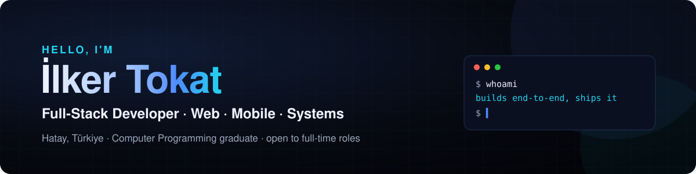

  

  
  
  
  

### 👋 About me

I build end-to-end software across **web, mobile and systems**: from the interface to the database, from the server setup to deployment and maintenance.

- 💼 **Freelance since 2023:** websites and custom software for brands in tourism, food & beverage, automotive and B2B supply.
- 🖥️ **University IT technician (2024–2026):** campus network, labs and helpdesk support while studying Computer Programming.
- 🔍 I like to look under the hood: Linux servers, migrations, security audits and, when needed, reverse engineering.
- 🎯 **Open to full-time software developer / full-stack roles.**

### 🚀 Featured projects

| Project | What it does | Stack |
|---|---|---|
| [**Nabız**](https://github.com/ilkertokat/nabiz) | Self-hosted uptime & SSL monitoring dashboard with REST API, public status page and Telegram alerts | Python · Flask · SQLite · Docker |
| [**Görev API**](https://github.com/ilkertokat/gorev-api) | Task management REST API: JWT auth, rate limiting, per-user isolation, OpenAPI + Swagger UI | Node 24 · TypeScript · Express 5 |
| [**Kayıt Dedektifi**](https://github.com/ilkertokat/kayit-dedektifi) | Finds SQLi, XSS, brute-force attempts and scanners in Apache/Nginx access logs | C# · .NET 10 · xUnit |
| [**WP Denetim**](https://github.com/ilkertokat/wp-denetim) | Passive WordPress security audit with an A–F grade, HTML/JSON reports and a CI gate | Python · httpx · rich · typer |
| [**Rutin**](https://github.com/ilkertokat/rutin) | Gamified Android habit tracker with an adaptive notification engine; no Gradle, zero dependencies | Java · Android SDK |
| [**Demir**](https://github.com/ilkertokat/demir) | Offline-first workout & weight tracker that adapts to your goal and equipment | React · Tailwind · PWA · Android |
| [**Teklif**](https://github.com/ilkertokat/teklif) | In-browser quote & invoice builder: VAT grouping, amount in words, PDF export | React · TypeScript · Vite · Vitest |

Backend and tooling projects ship with automated tests and CI; every README is bilingual (EN/TR). More on <a href="https://ilkertokat.com">ilkertokat.com</a>.

### 🧰 Tech I work with

  
  
  
  
  
  
  

  
  
  
  
  
  
  

  
  
  
  
  
  
  

### 🌍 Languages

Turkish (native) · English (B2) · German (A1)

---

<b>🇹🇷 Türkçe</b>

 

Merhaba, ben İlker. Web, mobil ve sistem tarafında uçtan uca yazılım geliştiriyorum: arayüzden veritabanına, sunucu kurulumundan yayına ve bakıma kadar.

- 2023'ten beri freelance olarak turizm, gastronomi, otomotiv ve B2B tedarik sektörlerindeki markalar için web siteleri ve yazılımlar geliştiriyorum.
- Bilgisayar Programcılığı okurken iki yıl (2024–2026) üniversitenin bilgi işlem biriminde IT teknisyeni olarak çalıştım.
- Linux sunucular, site taşıma, güvenlik denetimi ve gerektiğinde tersine mühendislikle bir yazılımın içini incelemeyi seviyorum.
- **Tam zamanlı yazılım geliştirici / full-stack pozisyonlarına açığım.**

Arka uç ve araç projelerinde otomatik testler ve CI var; tüm README’ler Türkçe/İngilizce. Daha fazlası: [ilkertokat.com](https://ilkertokat.com) · [Özgeçmiş](https://ilkertokat.com/ozgecmis/)

